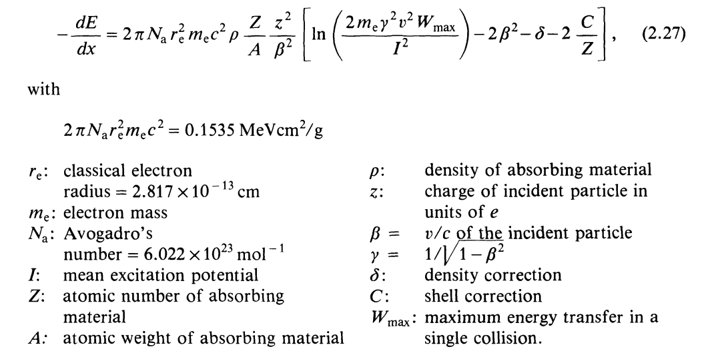
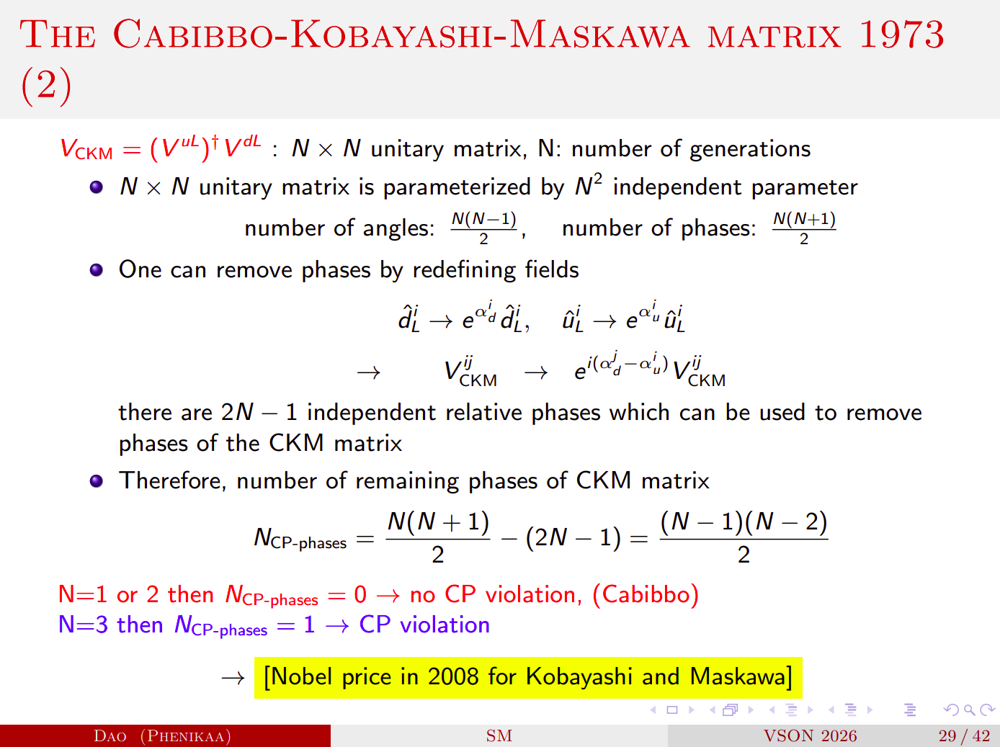
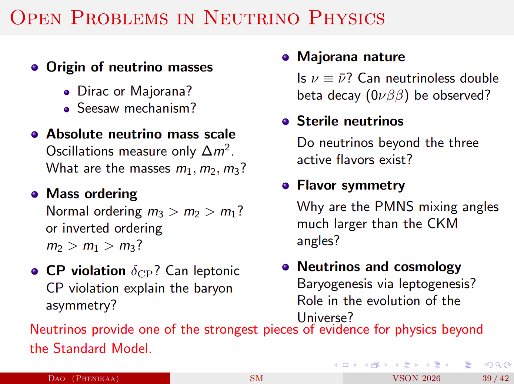
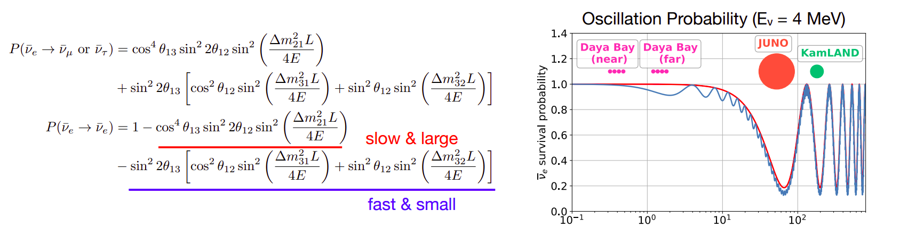
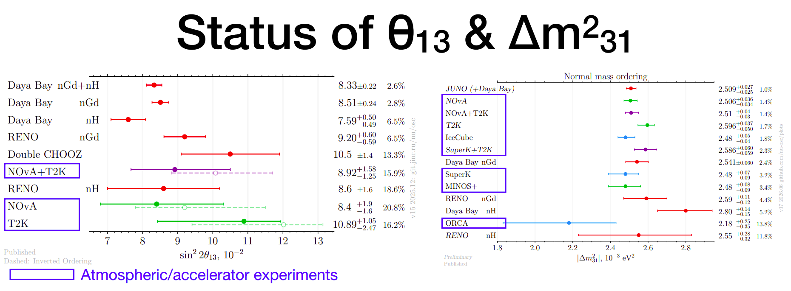

----------------------------------------------------------------
title: Notes from VSoN10 
author: Anirban Basak
Date: July 2026
----------------------------------------------------------------
# Notes from VSoN10 (July 2026)
================================================================
## Day 1 (15th July 2026, Tuesday)
### Neutrino physics - Introduction and first 50 years (Yuichi Oyama, KEK/J-PARC)

* KGF experiment and atmospheric neutrino detection.
* NC channel discovery in neutrino interaction.
* what is matter fermion?
* Why there is no matter consists of neutrinos similar to that of matter fermions?
   * *If we consider leptons as SU(2) doublets, it can be assumed neutrino interaction changes upper state to lowerstate before and after respectively.*
* Comparison between hadron-neuclei interaction $\sigma \approx 3 \times 10^{-26} cm^{-2}$ whereas, neutrino-neuclei interaction $\sigma \approx 1 \times 10^{-38} cm^{-2}$.

* *STUDY ABOUT SAVANA RIVER EXPERIEMT BY REINES AND COWAN*
    * This leads to discovery of anti-neutrinos.
    * **The basic principle:** two photons will come from $\bar{\nu}_e + p \rightarrow e^{-} + n$  and $e^{-}\rightarrow \gamma\gamma$, $n + Cd \rightarrow Cd^{*} \rightarrow Cd + \gamma$. i.e. two gammas detected withing 5 mircosec interval. Conicedence tecnique is use to detect the neutrino.
    * $3.0 \pm 2.0$ events per hour is recorded.
* Muon neutrino discovery by **AGS Experiment** by BNL. 
  * *Physics Goal:*Same type of neutrinos ($\nu_e$) as Savana river experiment or not.
  * *Spark chamber* is used to detect the neutrinos. Coincedence signal is used between two scintillation hits. Spark chamber gives long tracks for muons whereas for electron it shows a shower like character.
  * If neutrinos from muon decays are assumed to be electron type then total ~29 events expected whereas only 6 is obeserved.
  * Which gives an idea of different 2nd different of neutrinos.
  * *Is this 1st accelerator neutrino experiment??*

* *STUDY ABOUT KGF Experiment*
  * *Physics goal:* Is to observed atmospheric neutrinos.
  * KGF have very small cosmic ray flux which helps to study neutrinos by removing cosmic background.
  * Plastic scintillator is used in this experiment.
  * PMTs are used to detect the photons.
  * Type I, Type II and Type III plastic scintillators.
  * All 3 events are catgorized into Type I experiment except from the atmospheric neutrinos.
  * Another South african mine experiments collieds with publication results from KGF.
  * Detection is same as the AGS experiment.

* *HAVE TO STUDY ABOUT HOMESTAKE EXPERIMENT!*

  $$
  Cl + \nu_e \rightarrow Ar + e^{-}
  $$
 
* Davis Nobel prize at 2002. 
* **Have to take into account that all these experiments was focus on CC interaction while detection. In Case of AGS experiment the production too.**
* Neutrino interaction via gauge bosons.
* Mass of W boson is $~ 140$ GeV which tells that they will exsists for very short time, from uncertainity principle $\Delta E . \Delta t \geq \hbar /2 $.
* And time (t) is small hence, Range given by, $R \approx c\Delta t$ will be small.
* Cross section $\sigma \propto R^{2}$, the cross section of W boson are small, indicating hard to detect. **Is there any experiment to detect W boson?**
* **HAVE TO UNDERSTAND ABOUT THE MATRIX REPRESENTATION OF ELECTRO-WEAK INTERACTION**
  * W boson are off diagonal and Z boson is off diagonal. (*This may indiacte why NC is flavor independent!*)
* Similar to Z boson, photon is also diagonal matrix GWS model/Standard model.
* **HAVE TO STUDY ABOUT HIGGS PARTICLE AND SPONTANEOUS SYMMETRY BREAKING!**
* In 1973, NC Interactions were introduced. This is the experimental evidence of GWS model. NC interaction was discovered in **Gargamelle experiment** in CERN.
  * Gargamelle detector is a bubble chamber.
  * $\bar{\nu}_e e^{-} \rightarrow \bar{\nu}_e e^{-}$ : **No muon neutrino produced**
  * $\bar{\nu}{_\mu}+ N \rightarrow \bar{\nu}{_\mu} + hadrons$ :**No muon neutrino produced**
  * **[Q] HOW THIS CAN BE CONCLUDED FROM THIS TWO ABOVE REACTION THAT THERE EXSISTS A NC CHANNEL!!**
* GWS was awarded because of the discovery of NC, which gave experimental evidence of GWS prediction of NC interaction.
* In 1983, W and Z boson discovery UA1/UA2 experiment in SppS, CERN.
* In 2012, Higgs particle discovery in LHC CERN.

### Experimental neutrino physics concepts in a nutshell (Son Cao, IFIRSE)

#### Introduction to LBL:

* Why three flavor of neutrinos (/leptons)?
* What is a particle?
  * It is a excitation in of Quantum Fields.
* How particles have mass?
  * Particle have mass when they interact with Higgs particle. Number of interaction equivalent to mass. If interaction number is high mass of the particle will be high.
  * To interact with Higgs both chirality of the particles are needed.
  * That's why talking about the mass of neutrinos is a controversial topic as neutrino is left handed and antineutrino is right handed.
* **HAVE TO STUDY ABOUT THE NEUTRINO MASS GENERATION!!**
* **HAVE TO UNDERSTAND SUPERPOSITION OF MASS EIGENSTATES IN CONTEXT OF ROTATION.**
* $\theta_{13} \neq 0.0$ allows us to measure $\delta_{CP}$.
* Some experiment like solar neutrino experiments consoders $\theta_{13} = 0.0$ approximation.
* Uncertainities are important in LBL experiments.
* Understanding of the datas are important. i.e. **You must know what you are doing!!**
* Why right handed neutrinos supposed to existis in low energy range?

#### Neutrino detection:

* **The first thing is we can not see neutrino, instead we look at the effects of neutrinos when interacts with matter such as nucleons and we look into the photons produced in the process with the help of the detector.**
* Things to note while detecting neutrinos:
  * Is this really neutrino?
  * Energy of the neutrinos?
  * Flavor of the neutrinos?

* Neutrinos produces very faint flash of lights in detectors. **What are the measure of it?**
* Neutrino nuclei interactions are very complicated.
* Material selection depends on the physics goal and economy of the experiment.
* *Simulation is imporant to understand the data.*

#### Histogram in HEP:

* Histogram is an important tool to visualize tha data.
* 2D and multidimensional histograms.

* **Signal :** Is the one which we want to study.
* **Background :** Is the anything else.
* In experimental physics, it is important to define what is the signal is.
  * Such example is $\nu_{\mu}$ beam contains some fraction of $\nu_e$.
* Ratio of signal to background is an imporant quantity to understand the data.
* Distinguishing between siganl and background is called **classification problem**.
  * Machine Learning is used to solve this problem.
* To make the selection of typically a likelihood of data to be signal or bkg is built which is called *particle identification (PID)*.

#### Hypothesis testing:

* $H_0$ : Null hypothesis what we want to reject.
* $H_1$ : what we want to examine.
* E.g. :
  *  $H_0$ $\rightarrow$ Normal mass ordering.
  * $H_1$ $\rightarrow$ Inverted mass ordering.
* There are four possibilities:
  * $H_0$ true, $H_1$ false.
  * $H_1$ true, $H_0$ false.
  * Both true.
  * both false.
* Later two cases are difficult to deal with.

* There is errors related to hypothesis testing. Such as,
  * $H_0$ : $\theta_{13} = 0$
  * $H_1$ : $\theta_{13} \neq  0$ .
* Error:
  * **Type I Error :** rejects $H_0$ even though it is true.
  * **Type II Error :** rejects $H_1$ even though it is true.

* **"Hypothesis can be ruled out, never be proven to be true." - Karl Popper**

* **HAVE TO LEARN ABOUT p-value**

* *T2K have good sensitivity to CP, NOvA has good sensitivity to CP but not good sensitivity to mass hierarchy.* - what does this mean?
* Parameter estimation using $\chi^2$.

#### *Systematics* while reporitng the data:

* This is measure of uncertainities related to our experimnet.
* The needed to be included in the analysis.
* They must be included along with there correlations between them. **[Q] How to measure this correlation between them?**

#### Monte-Carlo simulation:

* Calculate pi value using MC simulation.
* Brownian motion MC.
* Toy model of virus transformation.

### Handson traning:

* Tracking cosmic muon can help us to understand time dialation, Fermi coupling, test of Partiy-violation.

-------------------------------------------------------------------------------

## Day 2 (16th July 2026)

### Particle and radiation detector 1/2 (Tsuyoshi Nakaya, Kyoto Univ., Hyper-K)

* X-rays and $\gamma$ radiation.
* Detection of charged particle and neutral particle happens differently. 
* **Books:**
  * Knoll
  * Leo
  * Introduction to expt. particle physics
  * detector for particle ration
* Difference between gamma ray and X-rays. **They are photons but depending production and energy gamma ray and X-ray are classified.**
  * X-ray comes from atomic process.
  * gamma photon comes from nuclear process.
* Nuclear physicist use half-life time whereas, particle physicist uses life-time (/Avg. life time) 
* In photon detector we detect single photon. **MPPC can detect one photon. But what type of photon visible light, gamma photon or some thing else.**

#### Visble light:

$$
  E = h \nu \\
$$
$$
\lambda = \frac{1.240 \times 10^{-6}}{E}
$$
where, $\lambda$ in meters, E in eV

* So, we need two battery of 1.5 V to generate red lights.
* Sun temp. is 6000k, using Black body radiation we can determine the wavelenght from wein's displacement law. Then we can compute the Energy. Which will lie withing white range.
* Temp. of our body is 300k, photons from our body in long wavelegnth range.

#### Other radiation:

* $\alpha$, $\beta$ and cosmic ray.
  * Cosmic ray consist of muon (1 muon/100 $cm^2$/ec)
  * Cosmic proton (Which is hydrogen nucleus, the most abundant particle in universe) interact with atmopsheric Nitrogen and Oxygen to produce pion.
  * Pions decay to muon and neutrinos.
  $$
  H^{+} = P \\
  P + N_2, O_2 \rightarrow \pi^{\pm, 0} + X (hadrons) \\
  \pi \rightarrow \mu + \nu_{\mu}
  $$

$$
\tau_\mu = 20 ns \\
\gamma c \tau_\mu =  \gamma \times 3 \times 10^{8} m/s \times 20 \times 10^{9} s 
$$

Where, $\gamma$ factor depends on energy of the proton energy and mass.

#### $\alpha$ particle:

* **[Q] Why $\alpha$ particle ($He^{4}_{2}$) is stable particle?**
  * s-orbit is most stable, $0^{+}$  is more stable nuclear states.

#### X-rays and $\gamma$ rays:
  * Bremsstralung radition is source of $\gamma$ ray, when relativistic charge particle propagates in electric field it emmits radition.
  * Synchrotron radtion is also a source of gamma rays, when relativistic charge particle moves inside a magnetic field.

#### Energy loss of heavy charged particle:

* How much energy is deposited inside the matter by a charge particle.
* Bethe bloch can formula can be used to detemined the energy deposited in unit length of a material.

* **Have to do Bethe bloch formula derivation!!**
* **[Q] How neutron deposites energy in matter. It is a neutral particle.**
* **[Q] What is the momentum of a muon to beMinimun ionization of particle (MIP)?**
  $$
  E= m\gamma \\
  p = m\beta \gamma \\
  \beta \gamma = \frac{p}{m}
  $$

  $m_{\mu} = 100 MeV/c^{2} \equiv 0.1 GeV /c^{2}$
  $$
  \beta \gamma = 3 \\
  or, p/m = 3 \\
  or, p/(0.1 Gev/c^{2}) = 3 \\
  or, p = 0.3 GeV/c
  $$
  * **Why $\beta\gamma =3?$**
    * From experimental plots.
  * Super-K have a diameter of 30m and for muon $-\frac{dE}{dx} = 2$ Mev/cm
  $$
  E_{deposite} = -\frac{dE}{dx} \times L \\
  or, E_{deposite} = 2 MeV/cm \times 30 \times 1000 \\
  or E_{deposite} = 6000 MeV \equiv 6 GeV
  $$
  Super-K can detect 6 GeV muons but in reality it can also detect higher energy muons.

* Even though Bethe-Bloch can be used for charged particle, but except electron beacuse during derivation of bethe-bloch we consider electron as target. Hence electron-electron collision will be not that much simple.

* Energy distribution of cosmic muon when pass through scintillator the distribution we get is called *Landau distribution*.

* While propagating charged particle losses energy due collsion as well as radiation such as Bremsstralung raditaion.
  $$
   -\frac{dE}{dx} = \left(\frac{dE}{dx}\right)_{Rad.} + \  \left(\frac{dE}{dx}\right)_{Col.}
  $$

* **Radiation length:** When the energy of the radiation becomes 1/e times to that of the initial one. 
* **Stopping power:** The distance when particle looses all the energy inside the medium.
* **Bragg's curve:** $\frac{dE}{dx}$ vs penitration length. This curve is used in medical treatment like cancer treatment.
*  **Range:** The distance where the particle number is halved from the initial one.
*  
* **[Q] What is the range of pion with 100 MeV??**
* Defining the range of electron is not easy as it do not follow st. path due to different type of radition process. Extrapolation can be used to determine it's range. 
* Interaction of $e^{+}$ is same while it is moving, but when it stops when anhilates and produce photons.
* **[Q] Why $e^{-}e^{+}$  decay via two channel one produced two photon and other three photon - why?**
  * *$e^{-}e^{+} \rightarrow \gamma \gamma$ (Spin 0) : para-positronium*
  * *$e^{-}e^{+} \rightarrow \gamma \gamma \gamma$ (Spin 1) : otho-positronium*
* **[Q] What is the lifetime of positronium?**

###  Standard model and neutrinos 1/2 (Nhung Dao, Phenikaa Univ.)

* Elementary particles are the fluctuation in quantum field.
* Electron and quarks are the smallest fundamentl particle till date.
* **[Q] How do we measure the size of the quarks?** 
* Point like particle are those whose size is $ <10^{-18}$.
* **[Q] How can we say electric charge is quantozed when up quark have electric charge of $+\frac{2}{3}$**
* Stable particle those which never deacys, i.e. $\tau \rightarrow \infty$
* Decay width is the measure of the particle how do they decay into other particles.
* Three most unstable particle in Standard Model is : **Higgs, W, Z , top quark**.
* **Virtual particles :** Particles those donot follow $E^2 = m^2 + p^2$ relation.
* In QM, particle numbers are fixed but in QFT they are not.
* **[Q] Why in QFT we use Lagrangian formalism whereas in QM we prefer Hamiltonian formalism?**
* **[Q] Why Lagrangian have a mass dimension 4?**
* **Anhilition operator in QFT:** Anhilates one particle.
* **Creation operator in QFT:** Creates one particle.
* **[Q] What is gravitino?**
* **[Q] Even though neutron is fermion it do not have any anti-particle-why??**
  * No, neutrino have antiparticle called antineutron.
* **Pauli exclusion principle:** Two fermions can't be in same state.
  * That's fermionic field have anti commutation relation rather than commutation relation.
* Dirac field have mass dimension of 3/2. **WHY??**
* **[Q] Why Dirac field have four components?**
* **[Q] Why mass term do not respect/affect chirality, i.e. incase of mass term left chiral and right chiral part of Dirac field comes jumbled up - why??**
* So, to exhibit mass we need both left handed and right handed part of the particles, neutrinos do not have right handed part, so in standard model neutrinos are massless. To define mass we need to go beyond SM.
* Higgs paricle : real scalar field. (Scalar because spin 0 and real beacuse EM charge 0)
* gluons, photon, Z : real vector field (vector because spin 1 and real beacuse EM charge 0)
* W boson : Complex vector field (vector because spin 1 and real beacuse EM charge $\pm$1)
* quarks : Dirac field.
* leptons, neutrinos : weyl spinors.
*  **Electromagnetic interaction treats left and right chirality equally.** 
*  **[Q] For weak interaction Lagrangian is of mass dimension of 6, but Lagrangian have to be of mass dimension of 4, what is happening?**
   *  This can be take care of introduction of W bosons. **HOW!**
* In 1983, SPS (Super Proton Synchroton) CERN , W and Z bosons are discovered. 
* **HAVE TO STUDY STRONG INTERACTION!**
* **TOPICS HAVE TO STUDY :**
  * Symmetry
  * Unitrary transformation
  * Abeliean Global symmentry
  * Abelian Gauge symmetry
  * QED
  * Non-Abeliean Gauge theory : Yang-Mills theory

#### Dark matter search with neutrino (Alba Domi, ECAP)

* **[Q] How can someone link with quantum gravity to neutrinos?**
* Quantum gravity can probe:
  * Black hole
  * Big bang
* *Quantum gravity is not renormalizable*.
* Success of standard model leads to used QED to string theory for unification of all forces.
  * **Fundamental principle:** Particles and gravity excitation of strings.
* General Relativity consider the curved manifold.
* No, experimental evidence of Quantum Gravity (QG).
* Plunk's scale is large. Which is difficult to reach in any current teristial experiments.
* Neutrino from different astrophysical source can solve this problem.
* **Quantum Coherence effect in neutrino oscillations** 
* **Lorentz invariance violation**
* IceCube's neutrino energy threshold starts from TeV range and it can go to PeV range.
* **Have to study about Cherekkov detection!!!**
* **"When neutrino propagates it propagates in mass eigen state"-What does this mean?!**
* **Decoherence in neutrino oscillation:** If the osciillation are done in decohereance state that means oscillation is damped. which indicates that we will get different flavor at same detector other than the predicted by 3 flavor oscillation.
  * Lindblad equation: Markovian time evolution equation.
  * **Lorentz invariance violation!!-What's that?**
  * **What is lorentx viaolating fields?**
  * Effect of lattitude in oscillation probabilities in astrophyical and atmospheric neutrinos.

--------------------------------------------------------------------------------

## Day 3 (17th July 2026)

### Particle and radiation detector 2/2 (Tsuyoshi Nakaya, Kyoto Univ.)

#### Interaction of photons:

* Photoelectric effect
* Crompton effect
* Pair production

#### Photoelectric effect:
* **[Q] Can this happen with free electron?**
  * Crompton scattering happens for free electron.
* **[Q] Does this process happen with the K-Shell e?**
* **[Q] Why does the probability becomes low at higher energy?**
* X-ray is emmitted after emition of photoelectron.
* Sometimes inseted of Xray emmission one L-shell electron is emmitted which is called Auger electron.

##### Compton effect:

* This happens for free electron but electron is never free it is bounded in metal. But what we assume is incident photon energy is very high than the binding eneergy of electron.
* **[Q] Using STR derive the Compton scattering formula.**
* **[Q] Calculate cross section using QED for Compton scattering.**
   *  This formula is called Kelin-Nsihima formula.

#### Pair production:

* * **[Q] Calculate cross section using QED for Pair production.**

#### Electro magnetic shower:

* When high energy photon (GeV) is incidented squential pair production happens. which is difficult to calculate by hand. We need simulation like GEANT to simulate it.

* EM shower radiation legnth is characteristics of the material.

* **[Q] Under approximation how much length an e$^-$ can travel?**
  * For T2K $\nu_\mu \rightarrow \nu_e$ and the $\nu_e$ interact with neutron of water and produce electron by, $\nu_e + n \rightarrow e^{-} + p $.
  * The energy of the electron in approx 1 GeV
  * From yesterday we know, $-\frac{dE}{dx} \approx 2MeV /cm$
  * So electronn can travel 1GeV/2MeV = 5 m.
* For electron shower :
  $$
  X_{max} \approx 4.5 X_0
  $$
  * $X_0$ : for water is 36 cm.

#### Charge particle detection:

* Charge particle produces an electron which can be detected by collecting in anode.
* Scintillation uses observation of excited atoms to detect charged particle.
* There are different scintillator like organic and inorganic scintillator.
  * Mechanisms are little different. They work mostly on the band structure.

#### Detection of free electron after Excitation:

* Semi conductor detectors can be buse to dection of free electron after excitation.
* MPPC is such type of semiconductor detectors.
* These detectors have better resolution relative to other.

#### How to detect photons:

* Photon is interacting and electron is the measure of the photon.
* While detecting the photons advantage lies in higher stopping power of material and higher atmoic number.
  * **[Q] Why high atomic number needed?**
* Scintillation mechanism depends on several things such as:
  * Temp.
  * material and particles.

* **Photo Multiplier Tube (PMT)** : measures the photons
* **Semiconductor detectors**
  * In high energy physics these detector work in reverse bias.
  * Used in verted detector.
* **Superconducting detectors**
  * Have high resolution than semiconductors.
  * Used in Dark matter detection.
  * Economically costly.

#### Different type of detectors:

* Cherenkov Detector
* Transition Raditaion Detector
* Time projection Chamber
* Nuclear Emulsion
* Nobel liquid detector

##### Cherenkov detector:

* Cherenkov radiation arises when charge particle in material moves faster than speed of light in the medium.
* This happens due to the polarization of the medium particle due to the charge particle.
$$
cos\theta_c = \frac{ct/n}{\beta ct} = \frac{1}{\beta n}
$$

Where, $\theta_c$ is the Cherenkov angle, $\beta = v/c$ and n is the refractive index. From this we can measure the angle of the chernkov ration from the vertex.

* **Disadvantages:** For Cherekov raditaion light yeild is very small. 
* Cherenkov yeild is $\propto 1/\lambda^{2}$

##### Nuclear Emulsion detectors:

* It can be think as how photons are taken in 20th centuty.
* A thin film is exposed to radiation. Which produces an image which can be process to get a image.
* Cosmic muon can be detected using this detectors.
* Photon can be detected using this technique.

##### Liquid Ar TPC:

* Used in DUNE.

###  Standard model and neutrinos 2/2 (Nhung Dao, Phenikaa Univ.)

* The gauge group for SM: SU(3) $\otimes$ SU(2)  $\otimes$ U(1).
  * SU(3)$_C$, C : for color charge. It has 8 generators with 8 gluons. Study of this strong force is called QCD.
  *  SU(2)$_L$ $\otimes$ U(1)$_{Y}$:
     *  This has 4 generators which leads to 4 gauge bosons W, Z and photon.
     *  This symmetry must be broken to give mass to the particles.

* **HAVE TO STUDY SU(3)$_{c}$ : STRONG INTERACTION**
* **HAVE TO STUDY SU(2)$_L$ $\otimes$ U(1)$_{Y}$ AND SYMMETRY BREAKING**
* Projection operator is $P_{L/R}$ and chiral operator is $\gamma_{5}$. **HAVE TO CLEAR THIS THING**
* Quark doublet can writen as $\begin{pmatrix} d_{L}  \\ u_{L} \end{pmatrix}$ but have to make sure all the physics remains the same so charges (EM, Hypercharge) must be modified accordingly.  
* **Number of independent element in CKM matrix:**
  
* This will be similar incase of PMNS too...
* There are still many questions on neutrinos such as:

* **Have to study SEESAW mechanism!!**
  
* **The Majorana phase can be estimated from neutrino less double beta decay ($0\nu\beta\beta$). The event rate is proportional to the linear combination of both phases. So, probing them individually is difficult but we can have an estimate if there exists Majorana phase or not.**

### Reactor neutrino experiments (Akira Takenaka, Sun Yat-sen Univ.)

* **Have to study the Nobel literature by Renines for 1st reactor neurino flux measuremnt.**
* Scintillation photon are isotropic and Cherenkov photons have direction information. The number of photon produced in scintillation is higher than of the Cherenkov process.
* **In reactor neutrino experiment we can observe $\nu_{\mu}, \nu_{\tau}$ as the antineutrino energy is low. So we observe antineutrino survival proability.**

* KamLAND reactor neutrino experiment can probe $\Delta m^2_{21}$, fast oscillation part for $\Delta m^2_{31}$ is invisible for KamLAND.

* **Delayed coincidence technique** is used in Cowan and Reines, KamLAND experiment. **WHat is that!?**

* Daya Bay experiment can probe the fast oscillation i.e. $sin^2(2\theta_{13})$.
* Accelerator/atmospheric neutrino results aligns with each other for $sin^2(2\theta_{13})$ and $|\Delta m^2_{31}|$.

* **Why uncertainity in $sin^2(2\theta_{13})$ is high in accelerator experiment whereas for $\Delta m^2_{31}$ uncertainity is high in reactor neutrino experiments ??** For JUNO $\Delta m^2_{31}$ uncertainity is small. **WHY?**

* **What is reactor neutrino anonmaly??**
* Reactor neutrino anomaly gives the motivation to study sterile neutrinos.
* JUNO uses same principle as KamLAND to detect neutrinos.

------------------------------------------------------------------------------

## Day 4 (18th july 2026)
### High energy neutrino astronomy and Supernova neutrino (Alba Domi, ECAP)